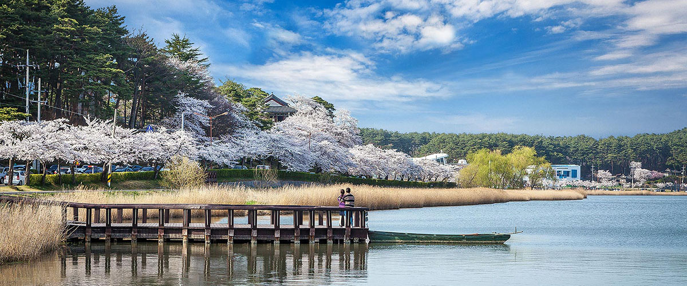

# 한국 벚꽃 여행: 봄의 화려한 탐험

벚꽃이 화사한 계절이 다가왔습니다! 2024년 봄, 한국은 벚꽃의 화려한 개화로 더욱 빛나고 있습니다. 한국관광공사에 따르면, 이번 벚꽃 시즌은 평년보다 최대 일주일 가량 빨리 찾아왔다고 합니다. 벚꽃의 개화시기는 3월 22일 부산을 시작으로 서울은 4월 3일에 피기 시작할 것으로 예상됩니다.이번 벚꽃 축제는 더욱 특별하며, 여러분을 매료시킬 아름다운 명소들이 기다리고 있습니다.

## 1. 서울 경복궁

수도의 중심에 위치한 경복궁은 벚꽃의 운치를 느끼기에 완벽한 장소입니다. 경회루 주변으로 펼쳐지는 수양벚꽃의 아름다움은 방문객을 매료시킵니다.

## 2. 진해

진해 군항제는 국내 최대 규모의 벚꽃 축제로, 36만 그루의 벚나무가 만들어내는 장관을 볼 수 있습니다. 여좌천의 벚꽃 터널, 경화역 철길, 안민고개 십리벚꽃길 등 진해 곳곳에서 벚꽃의 절경을 감상할 수 있습니다.

## 3. 섬진강 벚꽃길

1992년부터 조성된 섬진강 벚꽃길은 구례를 대표하는 3km의 벚나무 가로수 길로, 국도 17호선과 19호선을 따라 늘어서 있습니다. 이 아름다운 길은 섬진강의 청량한 물길을 따라 봄의 향기를 만끽하며 멋진 드라이브를 즐길 수 있습니다. 교통량이 적어 산책하기에도 좋고, 마라톤 코스로도 인기가 높습니다. 뿐만 아니라, 섬진강 벚꽃길은 ‘한국에서 가장 아름다운 길 100선’에 선정되었습니다.

또한, 섬진강은 은어를 비롯한 다양한 담수어의 서식지로 알려져 있습니다. 주변 식당에서는 은어회와 은어구이를 맛볼 수 있으며, 참게의 매콤한 맛이 어우러진 민물 매운탕도 인기 있습니다. 섬진강을 찾는 많은 여행객들의 사랑을 받고 있는 곳입니다.

## 4. 강릉 경포

매년 4월, 강릉 경포 일원에서 개최되는 강릉경포벚꽃축제는 강릉의 대표 봄 축제로서 많은 국내외 관광객들이 찾고 있습니다. 5.21㎞의 경포호수를 둘러싸고 있는 대표 봄꽃인 벚꽃나무들과 개나리, 수선화 등 아기자기한 작은 꽃들이 관광객을 반겨줍니다.
탁 트인 넓은 경포 호수를 산책하며 화려하고 아름다운 벚꽃에 휩싸여 하늘 위의 구름을 딛고 다니는듯한 황홀경에 빠지게 됩니다.

벚꽃은 우리 곁을 잠시 물들이는 아름다움입니다. 한국의 봄을 빛내는 이 아름다운 꽃을 만날 수 있는 명소들을 소개했습니다. 서울의 경복궁부터 강릉의 경포벚꽃축제까지, 각각의 장소에서 피어나는 벚꽃의 아름다움을 만끽하고 소중한 추억을 만들어 보세요. 봄은 짧지만, 그 짧은 순간에 머무르는 벚꽃의 아름다움은 우리에게 큰 힐링과 기쁨을 선사합니다. 함께 이 아름다운 계절을 즐겨보세요. 🌸✨
