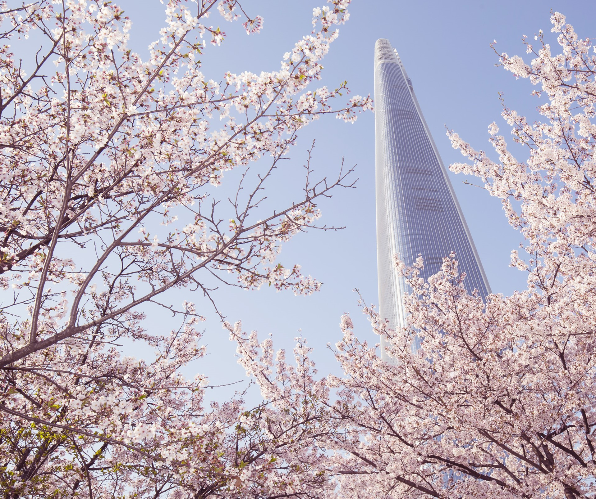
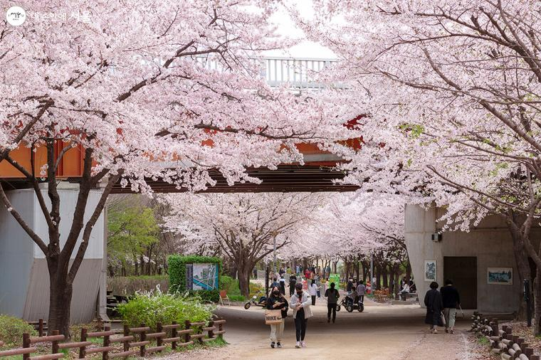
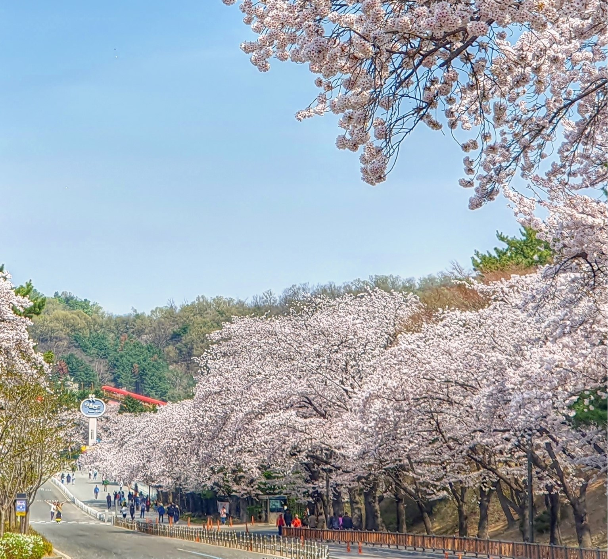
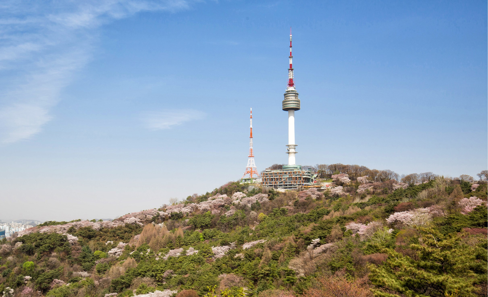
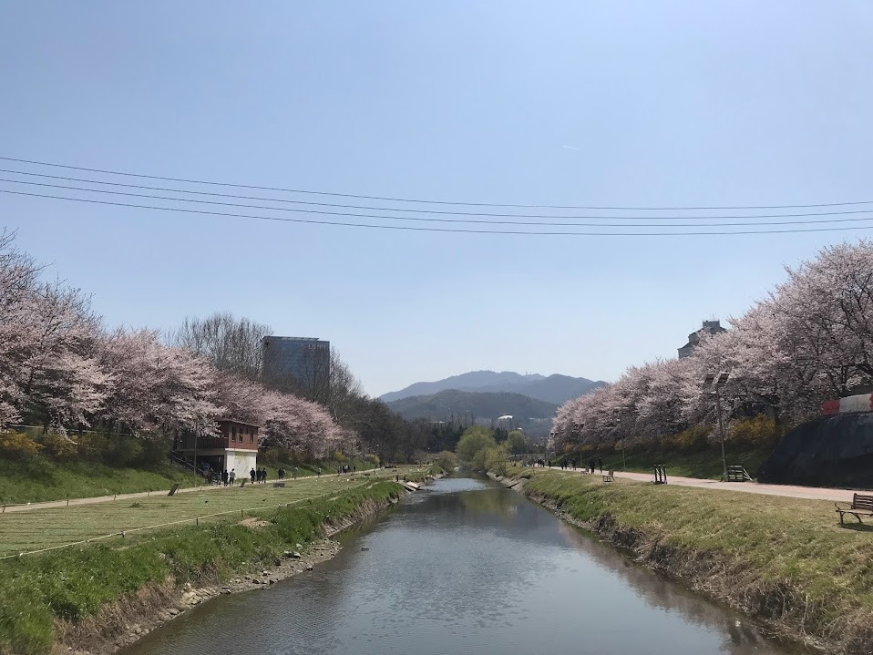

# 서울의 봄, 벚꽃으로 물들다!

서울의 봄은 벚꽃으로 더 아름답게 물들어요. 이른 봄부터 끝 봄까지, 서울 곳곳에 핑크빛 벚꽃이 만발하면서 시민들의 마음을 설레게 만드는 곳들이 있는데요. 

이번에는 서울의 벚꽃명소 여섯 곳을 소개할게요!

## 1. 석촌호수

서울의 봄을 대표하는 석촌호수! 롯데월드와 송리단길 사이에 위치해 있어 누구나 쉽게 찾을 수 있어요. 호수 주변을 한 바퀴 돌면서 음악 소리와 오리들의 행복한 모습을 감상할 수 있어요. 특히 벚꽃이 만개하면 이 곳은 로맨틱한 분위기로 가득 차요. 봄의 아름다움과 함께하는 석촌호수 산책은 정말 기분 좋아요!

## 2. 여의도

서울을 대표하는 벚꽃 명소 중 하나인 여의도! 한강을 배경으로 한 봄의 향연을 즐길 수 있어요. 윤중로 벚꽃길을 따라 걷다 보면, 서울의 화려한 봄이 펼쳐져 있어요. 데이트하기에도 딱인 곳이죠! 벚꽃을 감상하며 즐거운 식사도 해보세요.

## 3. 서울숲

서울숲은 시민들이 함께 만들어가는 공원이에요. 봄이 오면 끝없는 벚꽃길이 펼쳐져요. 특히 SNS에서 유명한 포토존, 바람의 언덕에서 찍는 사진은 한 마디로 환상적이에요! 벚꽃뿐만 아니라 다양한 봄꽃으로 가득 찬 서울숲은 정말 멋지죠?

## 4. 서울대공원

서울대공원은 동물원부터 캠핑까지 다양한 즐길 거리가 있는 곳이에요. 봄이 되면 대공원을 한 바퀴 돌면서 벚꽃을 감상할 수 있어요. 특히 벚꽃 드라이브 코스는 정말 멋진 경험이에요. 벚꽃 축제 때면 더욱 화려해요!

## 5. 남산

남산은 서울의 랜드마크 중 하나에요. 벚꽃이 만개하면 남산 둘레길은 환상적인 벚꽃 터널이 되어요. 천천히 걷다 보면 봄의 아름다움을 느낄 수 있어요. 또한 밤에는 남산의 야경과 함께 밤 벚꽃을 감상할 수 있어 로맨틱한 분위기를 더해줘요.

## 6. 양재천

서울 강남을 가로지르는 양재천은 봄이면 벚꽃으로 더 아름다워져요. 양재천은 산책로가 잘 되어 있어 가볍게 산책하기에 좋은 곳이에요. 특히 양재시민의숲 구간은 밤에는 라이트업이 되어 환상적인 야경을 감상할 수 있어요.

이렇게 서울 곳곳에 피어나는 벚꽃으로 물든 봄을 즐겨보세요! 

