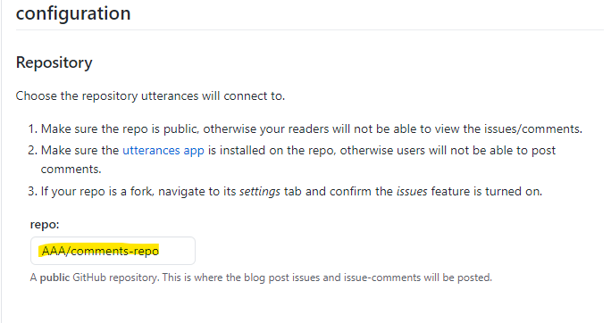
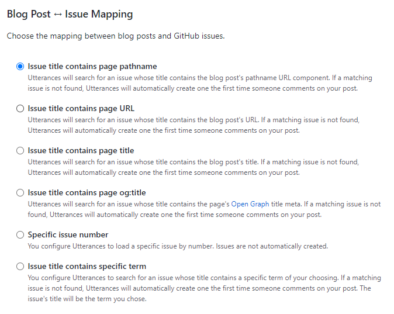
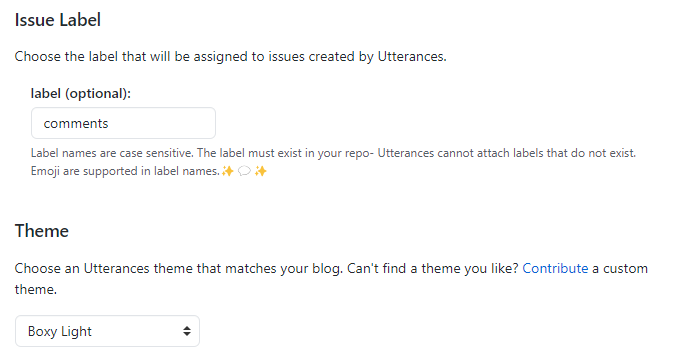
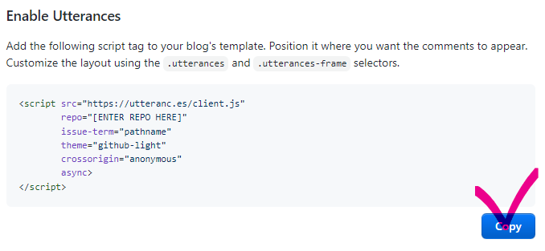
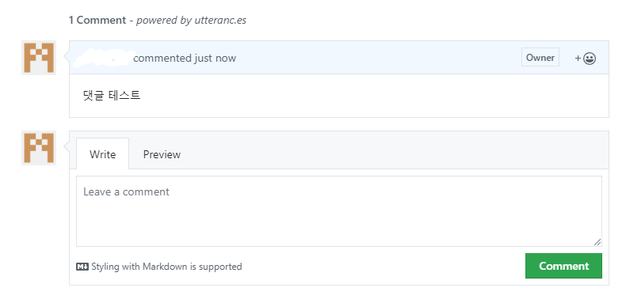

## Hugo에 Utterances 적용

블로그에 사용할 댓글 플랫폼으로 Utterances를 선택했습니다. Utterances는 Github 기반에 관리 및 설치가 간편하며, 댓글에 Markdown을 사용할 수 있는 장점이 있어 선택하게 되었습니다. 설치 방법은 다음과 같습니다.

1. 우선, 댓글용 Github Repository를 public으로 생성합니다. 일반적으로 'comments-repo'와 같은 이름으로 생성합니다.


2. 생성한 Repository에 `utterances.json` 파일을 만들고 아래와 같이 도메인을 설정합니다.

```json
{
  "origins": ["https://your-blog-name.com"]
}

```

3. Utterances 앱을 설치하고 앞서 생성한 Repository에 권한을 부여합니다.
[Utterances 앱 설치 주소](https://github.com/apps/utterances)

4. Utterances에서 원하는 설정을 선택하고 스크립트를 얻습니다.





```js
<script src="https://utteranc.es/client.js"
        repo="[ENTER REPO HERE]"
        issue-term="pathname"
        theme="github-light"
        crossorigin="anonymous"
        async>
</script>
```

5. 얻은 스크립트를 your-new-blog-name/layouts/partials/post/disqus.html에 생성하고 해당 파일에 스크립트를 삽입합니다.


위와 같이 적용하면 블로그 포스트의 하단에 Utterances 댓글 플랫폼이 표시되어 사람들이 댓글을 작성할 수 있습니다. 


댓글이 작성되면 앞서 설정한 Github Repository에 새로운 이슈가 생성되고 그 안에 댓글이 달립니다. 