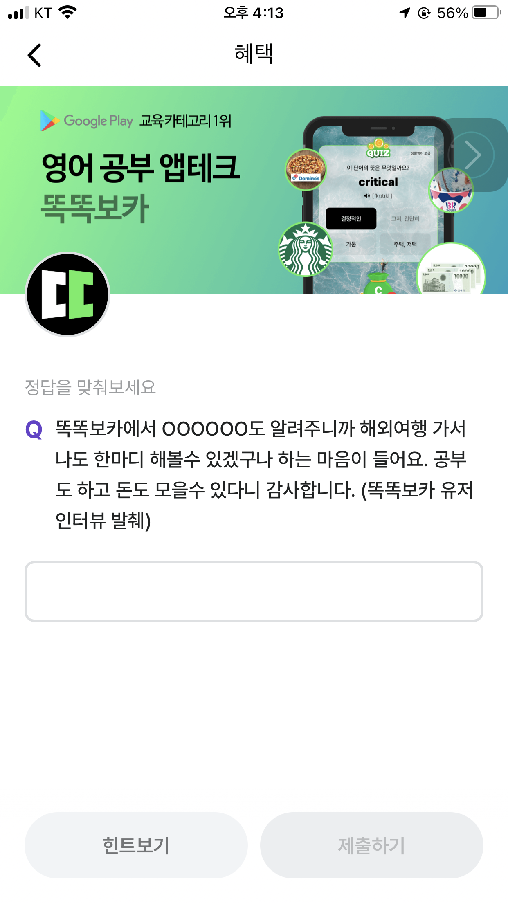

# 비트버니 퀴즈 정답 4월 9일

**비트버니는?**
- '만보기'를 통해 걷기만 해도 리워드 포인트가 적립되는 서비스
- 다양한 혜택으로 리워드 포인트를 획득할 수 있는 출석체크, 퀴즈 등의 기능 제공
- 모바일 쿠폰, 기프티콘 등 다양한 상품과 교환 가능
- 사용법이 간편하여 누구나 편리하게 이용할 수 있음

**비트버니 코인 사용법**
- 코인을 모아 비트코인 등의 가상화폐로 교환 가능
- 또한, 커피나 간식 등으로도 교환할 수 있는 앱

**비트버니 퀴즈**
- Q. 똑똑보카 유저 인터뷰에서는 해외여행 중에도 똑똑보카의 도움으로 외국어를 사용할 수 있다고 합니다. 이는 공부와 동시에 돈도 모을 수 있다는 장점이 있습니다.

# ***정답: 영어단어발음***

