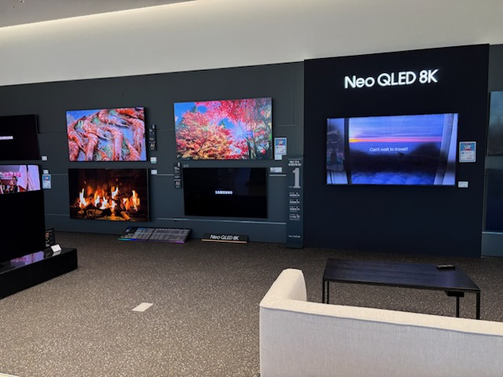
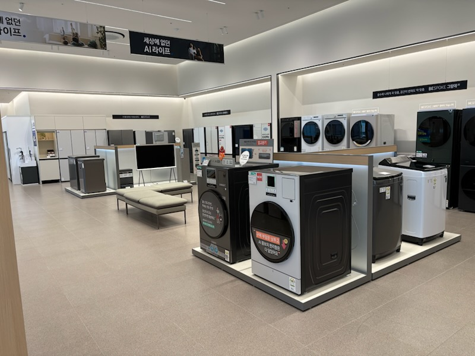
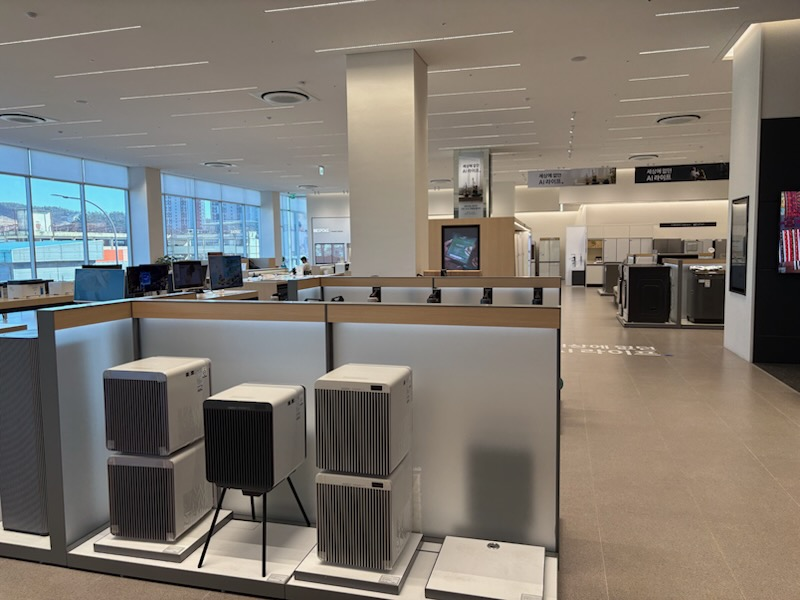
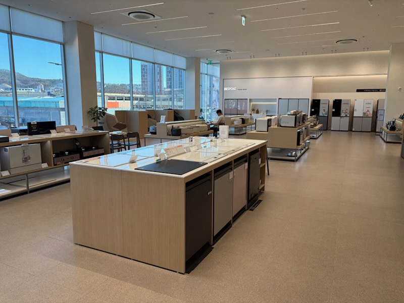
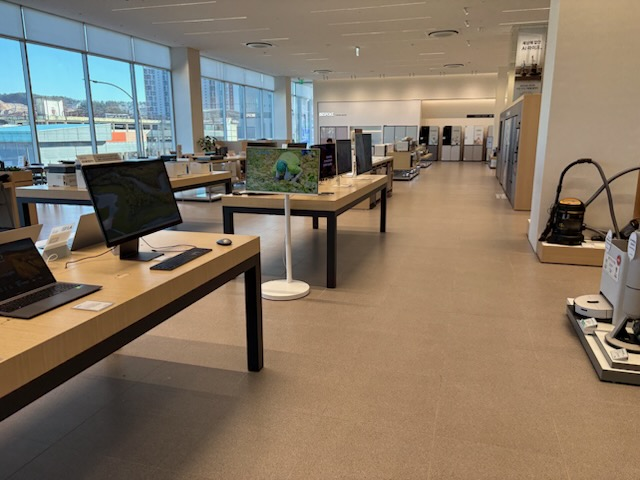
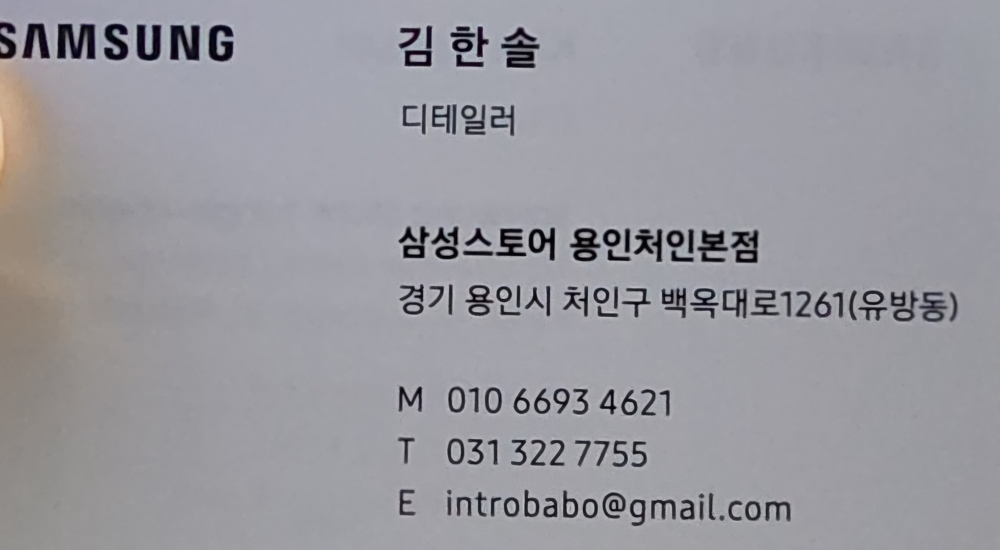

# 내돈내산 삼성스토어 계약, 구입 후기

 이번에 화성비봉 우미린에 입주하게 되면서 삼성스토어 용언처인점에서 필요한 가전을 모두 구입하였다. 집 근처의 삼성스토어, LG전자 베스트샵, 백화점 등 여러곳을 방문하여 견적을 내보았고 결국 가전성지라고 불리는 용인처인점에서 구매를 하게 되었다.

우리가 구입한 품목은 다음과 같다.

- TV, 사운드바, 세탁기, 건조기, 냉장고, 에어드레서, 청소기, 정수기, 밥솥, 공청기(사은품) 

TV에서 가장 중요하게 고려한 것은 크기와 빛반사였다. TV는 크면 클 수록 좋다니 거거익선!, 거기에 햇빛이나 거실등 반사되는게 불편하여 빛반사 보호가 되는 제품을 선택하였다.

세탁기와 건조기는 요즘 유행하는 올인원이나 타워형식이 아닌 각각 두고 사용할 수 모델을 선택하였고, 세탁이나 건조가 끝나고 일정시간이 지난 뒤에 자동으로 문이 열리는 오픈오토도어 기능이 있는 제품을 선택하였다.

냉장고는 바와 오토오픈토어 기능을 탑재한 제품을 선택하였고, 해당 기능은 선택가능하여 본인이 필요한 기능이 포함된 제품을 선택하면 된다.

 

 

제품 구매처 선택시 고려하여야할 것

 * 예를들어 85인치 Neo QLED TV를 했을때 백화점의 경우 QND95의 최고등급, 삼성스토어의 경우 QND90, QND85등 중상등급, 하이마트 등에서는 QND80등 하위등급의 제품을 다루고 있다. 본인의 예산과 중요하게 생각하는 부분을 따져 선택하면 된다.

 * 또한, 구입시 다품목 구매혜택이 존재하며, 그 혜택은 구입품목이 늘어날 수록 좋아지게 된다. 필요한 가전은 7개의 구매보다 추가로 1개를 더 구매하여 8개 다품목 할인 혜택을 받을 경우 7개를 사는 것보다 최종혜택가는 좋아지는 경우가 있다.
하지만 한가지 유의할 점은 TV세트(메인TV + 서브TV서브 + 사운드바)를 구입하더라도 3개 품목이 아닌 1개 품목으로 인정된다는 점과 추가 가전을 구매할 경우 상품권, 캐시백 등 추가 최종구매가는 감소하지만 총 결제가격은 올르게 된다.

 * 우리는 거실TV는 필요하지만 서브TV는 필요가 없었다. 혜택을 위해 불필요한 가전을 구매하여 직접 중고나라에 판매해야하는 등 처리 문제(우리는 디테일러님의 도움으로 해결하였다.)
 
우리가 용인처인점을 선택한 이유

1. 합리적인 가격

  * 견적을 내는데 백화점, 삼성스토어 등 가는 곳마다 동일 모델에 대한 혜탁가가 다르고 취급하는 모델이 달라 선택하는데 많은 고민을 했으나 그 중 견적이 가장 합리적이었다. (백화점은 추가 할인 혜택이 부족하고, 집 근처에 방문한 삼성스토어는 본인들 실적을 위하여 휴대폰을 추가시켰다.)
  
2. 친절함

  * 담당했던 김한솔 디테일러님의 천절함, 구매 제품에 대한 상세한 설명과 구매혜택 및 불필요한 상품 처리 방법 등에 대한 상세한 설명이 좋았다.

어려운 입주가전 준비! 합리적인 가격과 다양한 혜택과 함게 하고 싶으시다면 삼성스토어 용인처인점을 방문을 추천드립니다.

