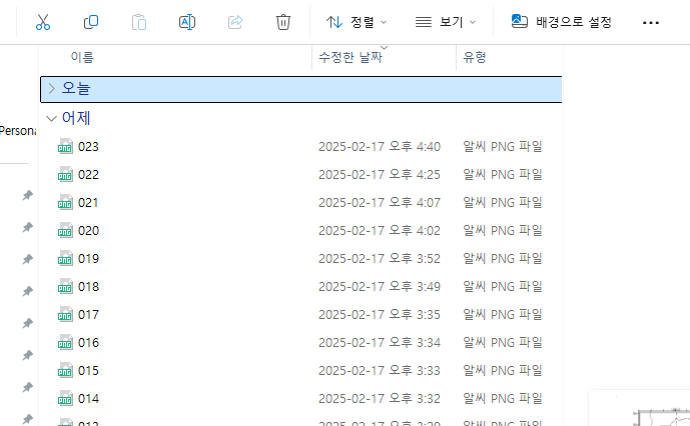
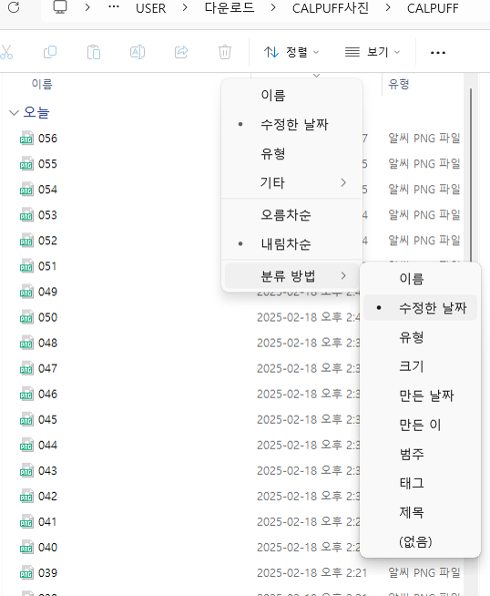

윈도우 11을 사용 중에 유독 다운로드 폴더의 정렬 방식이 날짜 형태로 나타나는 경우가 있다.
어제, 이번 주 초, 지난주, 지난달, 올해 초, 날짜 등 시기에 따라 분류돼서 나타난다.
파일들이 이름순서대로 나열하여 확인하고 싶으나 수정 날짜 별로 파일이 정렬되면 파일을 확인하고 관리하는데 어려움이 있다.

# 윈도우 11 폴더 날짜 정렬 해결 방법

윈도우 11 폴더 날짜 정렬을 다시 되돌리는 방법은 폴더의 정렬에서 분류 방법을 설정한다.

메뉴에서 정렬 - 분류 방법 - (없음)

(없음)으로 설정하면 파일을 분류하지 않는다. 

다른 분류 방법을 선택하면 선택한 분류 방법에 따라 분류되니 원하는 폴더 분류 방식을 선택하자.

