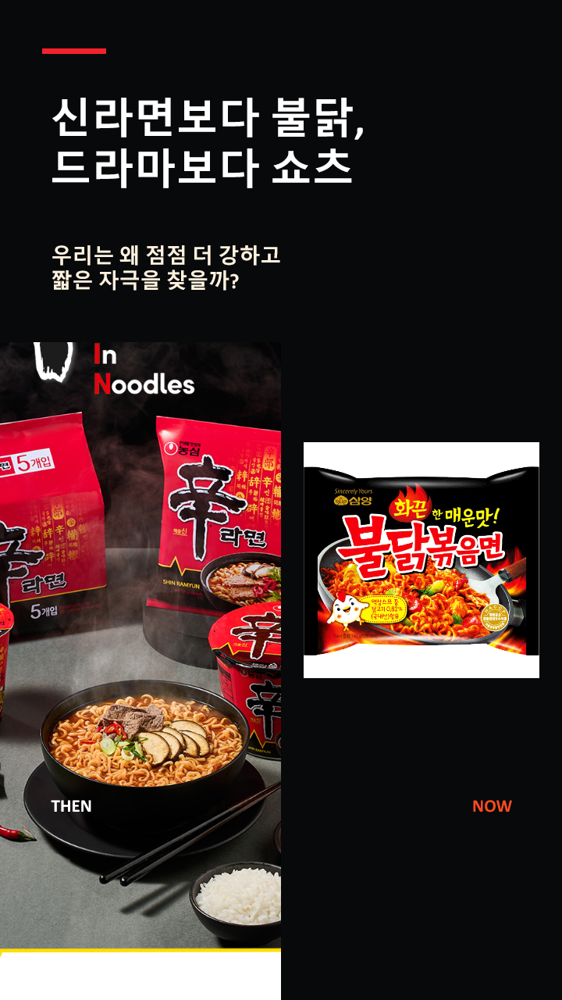
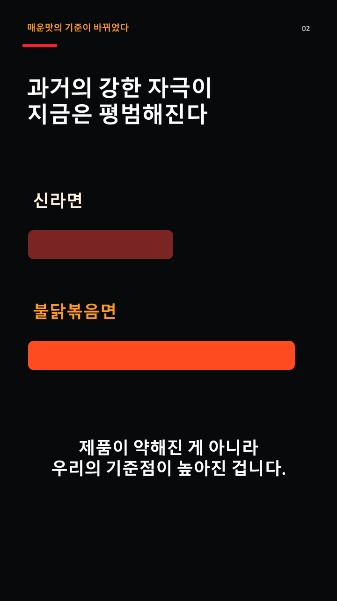
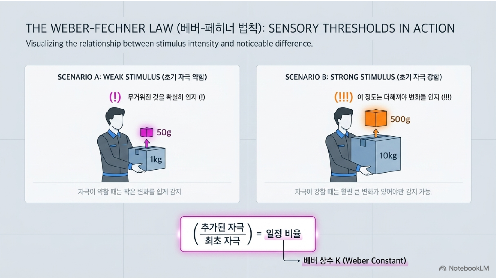
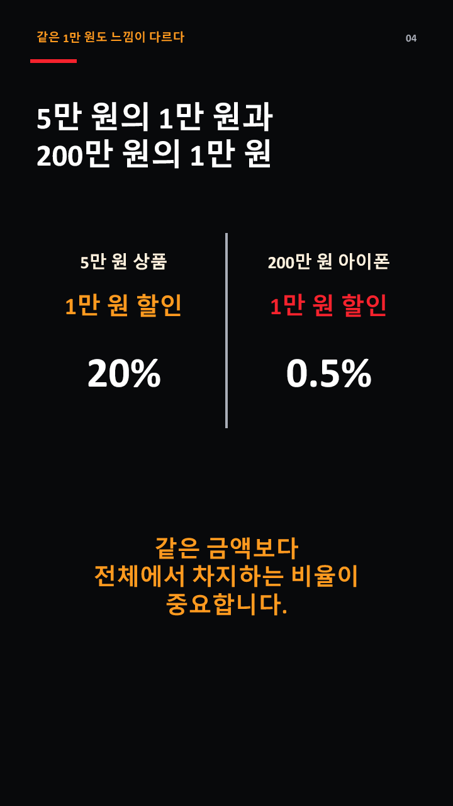
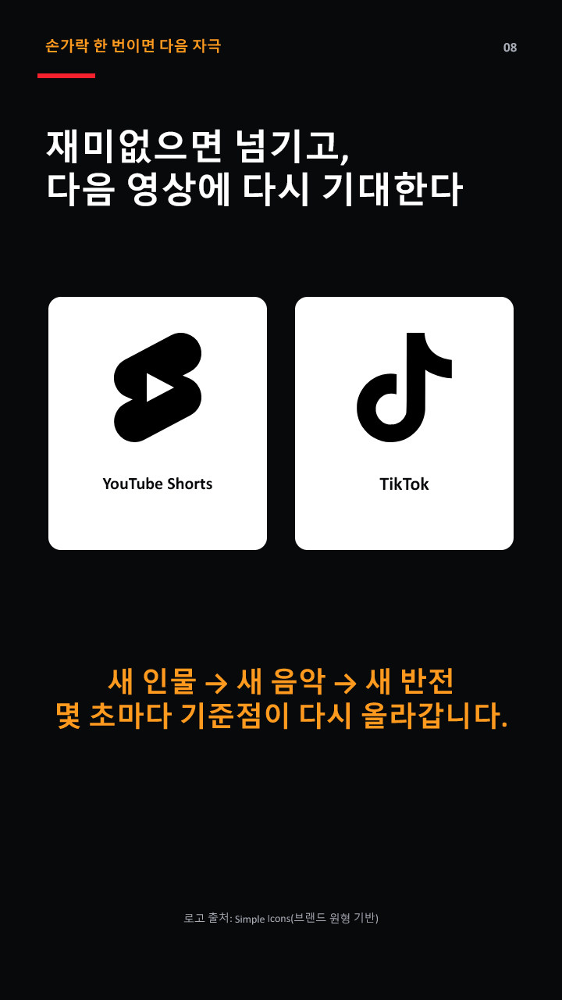
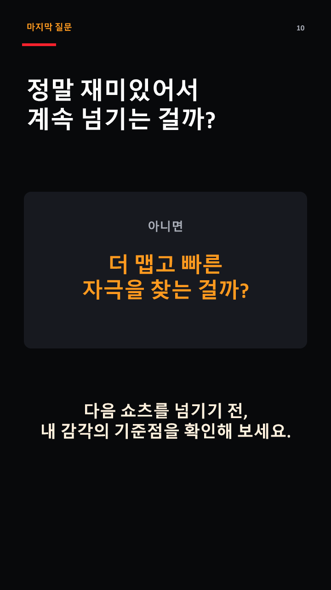

한때 신라면은 매운 라면의 대표 주자였습니다. ‘사나이 울리는 신라면’이라는 광고 문구처럼, 당시에는 매운맛 자체가 강력한 차별점이었죠.

하지만 지금은 불닭볶음면을 비롯해 훨씬 강한 매운맛을 내세운 제품이 인기를 얻고 있습니다. 매운맛에 익숙한 사람에게 신라면은 더 이상 특별히 맵지 않은 라면으로 느껴지기도 합니다.

신라면의 맛이 약해진 것일까요? 아니면 강한 자극에 익숙해진 우리의 기준이 달라진 것일까요?

이런 현상은 음식에서만 나타나지 않습니다. 넷플릭스 같은 OTT를 보다가도 전개가 조금만 느리면 다른 작품으로 이동하고, 이제는 한 시간짜리 드라마보다 몇십 초 안에 웃음과 반전을 제공하는 쇼츠와 틱톡을 찾습니다.

신라면보다 불닭볶음면을 찾고, 드라마보다 쇼츠를 찾는 현상. 두 행동에는 어떤 공통점이 있을까요?

<!--more-->

## 매운맛의 기준이 달라졌다

강한 맛에 익숙해지면 이전의 매운맛은 상대적으로 약하게 느껴질 수 있습니다. 제품이 약해진 것이 아니라, 소비자가 자극을 판단하는 기준점이 높아진 것입니다.

어제는 충분히 매웠던 음식이 오늘은 평범하게 느껴지고, 이전과 다른 경험을 얻으려면 더 강한 맛을 찾게 됩니다. 이런 변화는 ‘베버-페히너 법칙’으로 생각해 볼 수 있습니다.

## 자극의 절대량보다 중요한 것은 변화의 비율

베버-페히너 법칙은 사람의 감각이 물리적인 자극의 크기와 똑같은 비율로 증가하지 않는다는 정신물리학의 개념입니다.

쉽게 말하면 사람은 자극의 절대적인 차이보다 기존 자극에서 얼마나 크게 달라졌는지를 중요하게 느낍니다. 자극이 약할 때는 작은 변화도 쉽게 알아차리지만, 이미 자극이 강한 상태에서는 훨씬 큰 변화가 생겨야 차이를 감지할 수 있습니다.

예를 들어 1kg짜리 물건을 들고 있을 때는 작은 무게가 추가돼도 변화를 느낄 수 있습니다. 하지만 10kg짜리 물건을 들고 있다면 같은 무게가 추가되더라도 쉽게 알아차리지 못합니다.

처음 자극의 크기에 따라 변화를 느끼기 위해 필요한 최소한의 차이가 달라지는 것입니다. 이를 ‘최소식별차’라고 합니다.

## 같은 1만 원인데 할인 효과가 다른 이유

금액으로 비교하면 더 쉽게 이해할 수 있습니다.

5만 원짜리 상품을 1만 원 할인해 준다고 가정해 보겠습니다. 할인율은 20%입니다. 조금 떨어진 매장이라도 직접 찾아가고 싶을 만큼 상당히 큰 할인으로 느껴질 수 있습니다.

반면 200만 원짜리 아이폰을 살 때 똑같이 1만 원을 할인해 준다면 어떨까요? 할인율은 0.5%에 불과합니다.

경제학적으로 1만 원의 절대적인 가치는 같습니다. 그러나 실제 소비자는 전체 가격에서 할인액이 차지하는 비율을 함께 인식합니다.

마케팅에서 할인 금액과 할인율을 다르게 강조하는 것도 이런 심리와 관련이 있습니다. 저가 상품은 할인율을 크게 보여주는 편이 효과적일 수 있고, 고가 상품은 작은 할인보다 사은품이나 보상판매처럼 고객이 체감할 만한 혜택을 제시해야 합니다.

## 넷플릭스의 첫 장면이 빨라진 이유

이제 콘텐츠로 시선을 옮겨보겠습니다.

OTT 서비스가 처음 등장했을 때는 원하는 콘텐츠를 원하는 시간에 볼 수 있다는 사실만으로도 충분히 새로웠습니다. 한 편이 끝난 뒤 다음 회차가 자동으로 재생되는 경험도 매력적이었습니다.

하지만 지금은 수많은 콘텐츠가 동시에 공개됩니다. 선택지가 많아지면서 시청자가 한 작품을 기다려주는 시간은 짧아졌습니다.

첫 장면이 조금만 지루해도 다른 작품으로 이동하고, 몇 분 안에 흥미로운 사건이 나오지 않으면 ‘재미없다’고 판단합니다.

제작자는 시청자가 이탈하기 전에 관심을 붙잡아야 합니다. 첫 장면부터 사건을 보여주고, 몇 분마다 새로운 갈등을 넣으며, 회차 마지막에는 결정적인 위기나 반전을 배치합니다. 다음 회를 보지 않고는 견디기 어렵게 만드는 ‘클리프행어’도 적극적으로 활용됩니다.

강한 콘텐츠가 반드시 좋은 콘텐츠라는 의미는 아닙니다. 다만 콘텐츠가 넘쳐나는 환경에서는 시청자가 알아차릴 만큼 분명한 차이가 있어야 선택받기 쉬워집니다. 콘텐츠가 넘어야 할 최소식별차가 높아진 셈입니다.

## 드라마보다 쇼츠를 찾게 되는 과정

강한 전개에 익숙해지면 한 시간짜리 드라마조차 길게 느껴질 수 있습니다. 그래서 사람들은 유튜브 쇼츠, 틱톡, 인스타그램 릴스처럼 더 짧고 빠른 콘텐츠를 찾습니다.

숏폼에서는 몇 초마다 새로운 인물과 음악, 정보와 반전이 등장합니다. 재미가 없으면 손가락으로 한 번만 밀어 다음 영상으로 넘어갈 수 있습니다.

다음에 어떤 영상이 나올지 모른다는 점도 계속 화면을 넘기게 합니다. 이번 영상이 재미없었더라도 다음 영상은 재미있을 수 있기 때문입니다.

출근길 엘리베이터 안에서, 점심 메뉴를 기다리는 동안, 퇴근 후 침대에 누워서도 부담 없이 볼 수 있습니다. 복잡한 등장인물이나 앞부분의 줄거리를 이해할 필요도 없습니다.

다만 짧고 강한 자극에 익숙해질수록 느린 콘텐츠를 기다리는 일은 상대적으로 어렵게 느껴질 수 있습니다. 드라마의 인물 소개가 답답해지고, 영화의 긴 대화 장면에서는 나도 모르게 스마트폰을 확인하게 됩니다.

신라면에 익숙해진 사람이 불닭볶음면을 찾는 것처럼, 긴 콘텐츠에 익숙했던 사람은 더 빠른 숏폼을 찾고, 숏폼에 익숙해진 사람은 몇 초 안에 더 강한 장면을 원하게 됩니다.

## 숏폼이 나쁜 것은 아니다

물론 숏폼 자체를 부정적으로만 볼 필요는 없습니다.

짧은 시간에 필요한 정보를 얻고 새로운 관심사를 발견할 수 있습니다. 복잡한 지식을 이해하기 쉽게 전달하거나, 알려지지 않은 창작자에게 새로운 기회를 제공하기도 합니다.

문제는 콘텐츠의 길이가 아니라 선택권입니다. 내가 필요해서 숏폼을 보고 있는지, 아니면 자극이 끊기는 순간을 견디지 못해 습관적으로 화면을 넘기고 있는지 구분할 필요가 있습니다.

베버-페히너 법칙만으로 숏폼 이용 행동 전체를 설명할 수는 없습니다. 개인화 추천, 무한 스크롤, 짧은 이용 단위와 같은 서비스 구조도 사용자의 행동에 영향을 줍니다.

다만 이 법칙은 강한 자극을 반복해서 접할수록 이전과 같은 자극이 상대적으로 평범하게 느껴질 수 있다는 점을 이해하는 유용한 관점을 제공합니다.

## 마케팅과 혁신에도 적용되는 최소식별차

최소식별차는 콘텐츠뿐 아니라 상품과 서비스의 혁신에도 중요한 의미가 있습니다.

기업은 매년 새로운 제품을 출시하지만 소비자가 그 차이를 알아차리지 못한다면 교체할 이유도 줄어듭니다. 스마트폰의 성능이 조금씩 향상되더라도 기존 제품과 비교해 체감할 만한 차이가 없다면 고객에게는 혁신으로 인식되지 않을 수 있습니다.

새로운 기능을 많이 넣는 것보다 고객이 중요하게 생각하는 한 가지 차이를 분명하게 만드는 것이 더 효과적일 수 있습니다.

결국 중요한 질문은 ‘얼마나 바꾸었는가’가 아닙니다.

**고객이 알아차릴 만큼 바꾸었는가**입니다.

## 우리는 정말 더 재미있는 것을 찾는 걸까?

콘텐츠의 자극성과 시청자의 높아진 기대치는 서로를 끌어올립니다.

시청자가 빠르고 강한 콘텐츠를 선택하면 제작자는 더 강한 콘텐츠를 만듭니다. 다시 그 콘텐츠에 익숙해진 시청자는 이전보다 더 큰 자극을 요구합니다.

신라면에서 불닭볶음면으로, 드라마에서 쇼츠로 이동하는 과정은 단순한 유행의 변화만은 아닐지 모릅니다. 우리의 감각과 선택 기준이 어떻게 달라지고 있는지를 보여주는 장면일 수도 있습니다.

오늘도 무심코 쇼츠나 틱톡을 열었다면 다음 영상을 넘기기 전에 한번 생각해 보세요.

지금 내가 찾는 것은 정말 보고 싶은 콘텐츠일까요?

아니면 더 맵고, 더 빠르고, 더 강한 또 하나의 자극일까요?
